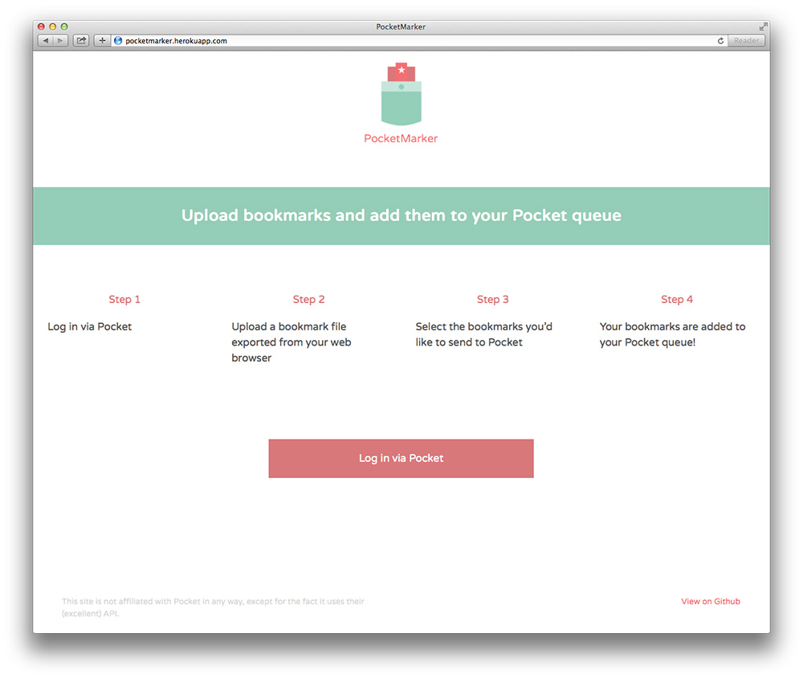
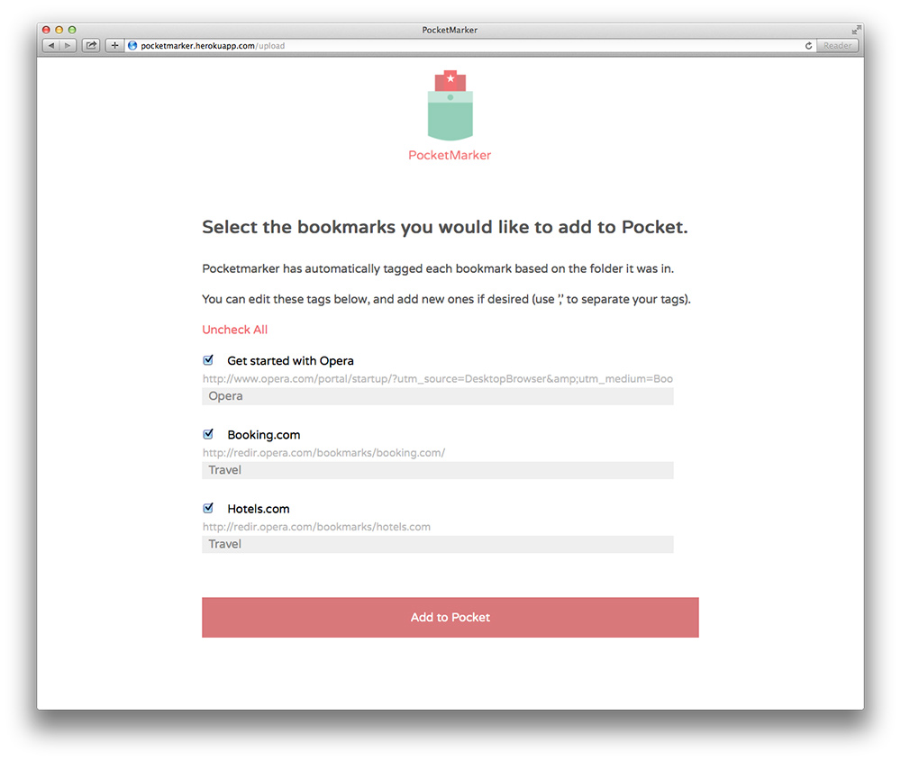

# Pocketmarker




A Sinatra app that allows you to add items to [Pocket](http://getpocket) from an exported bookmarks file.

See it in action on [heroku](http://pocketmarker.herokuapp.com).

### Configuring the App

The first thing you will need to do is [register a new app at Pocket](http://getpocket.com/developer/apps/new) in order to receive a Consumer Key. Then, within the /config directory of the app, replace the example yaml file with one that contains your Consumer Key.

The app utilises OAuth2 to authenticate users and retrieve access tokens, which are subsequently used to make API calls.

### Running the App

Install the required gems with:

```
bundle install
```


Then run the app using:

```
bundle exec rackup config.ru
```
